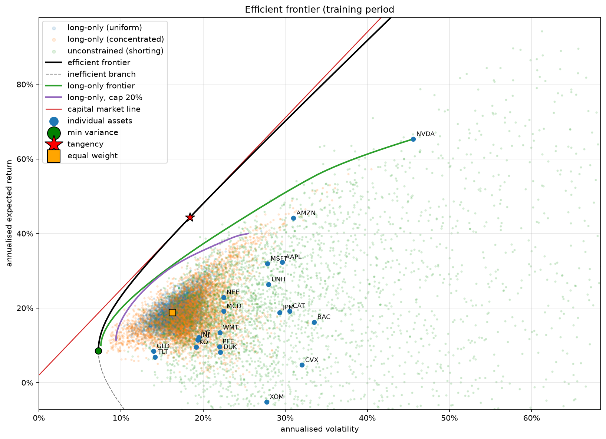

# Mean-Variance Portfolio Optimiser

A from-scratch implementation of Markowitz mean-variance optimisation on 20 US stocks and ETFs. It derives the optimal portfolios, traces the efficient frontier, adds realistic constraints, and then tests whether the "optimal" weights hold up on data they have never seen.

## What it does

1. **Data:** downloads adjusted daily prices for 20 tickers (2015-2025) with `yfinance`, caches them to `cache.csv`, and converts to daily simple returns.
2. **Estimation:** computes the annualised mean return vector (μ) and covariance matrix (Σ) from the **training period only** (2015-2020).
3. **Closed-form portfolios (shorting allowed):** the global minimum-variance portfolio, w ∝ Σ⁻¹**1**, and the tangency (max-Sharpe) portfolio, w ∝ Σ⁻¹(μ − r_f**1**), both derived with Lagrange multipliers.
4. **Efficient frontier:** traced using the two-fund theorem and plotted with the capital market line, the individual assets, and clouds of random portfolios.
5. **Constrained frontiers:** long-only and long-only with a 20% position cap, solved numerically with `cvxpy`, since inequality constraints remove the closed form.
6. **Out-of-sample test:** weights are frozen at the end of 2020 and scored on 2021-2025.

## Results

Sharpe ratios (risk-free rate fixed at 2%):

| Portfolio            | In-sample | Out-of-sample |
|----------------------|-----------|---------------|
| Min variance         | 0.91      | 0.39          |
| Tangency             | 2.30      | 0.43          |
| Long-only min var    | 1.05      | 0.32          |
| Long-only max Sharpe | 1.84      | 0.70          |
| Capped min var       | 1.01      | 0.75          |
| Capped max Sharpe    | 1.81      | 0.92          |
| Equal weight (1/N)   | 1.03      | 1.15          |

Every optimised portfolio fell short of its in-sample promise, while equal weight did not. The tighter the constraints, the smaller the gap: the 20% cap cost almost nothing in-sample but held up much better out-of-sample, consistent with the constraints protecting against overfitting.

The optimiser treats noisy sample estimates as if they were the truth, and bets heavily on whatever looked best by chance.
